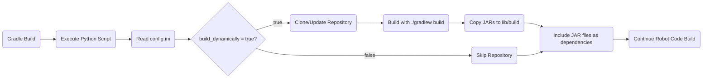

# Dynamic Source Building System

## Purpose

This system allows you to build robot code using dependencies built from source rather than pre-published libraries. When you need to use the latest changes from a library repository (including local modifications), you can configure the build system to automatically clone, build, and include the library's JAR files directly into your project. This is particularly useful during development when you need to test changes before they are officially released.

## Methodology

1. The `config.ini` file defines which libraries should be built dynamically from source.
2. During the Gradle build process, a Python script (`scripts/clone_and_build_repos.py`) is executed that:
   - Reads the configuration to determine which repositories to build
   - Clones the specified GitHub repositories into `lib/vendor/`
   - Builds each repository using their respective `./gradlew build` command
   - Copies the resulting JAR files to `lib/build/`
3. The `build.gradle` file then includes all JAR files from `lib/build/` as project dependencies.



### Configuration Behavior:
- **build_dynamically = true**: The repository is cloned (if not present), built from source, and JAR files are included as dependencies.
- **build_dynamically = false**: The repository is skipped entirely during the build process.

## Configuration

Libraries are configured in the `config.ini` file using the following format:

```ini
[LibraryName]
build_dynamically = true
github = https://github.com/user/repository.git
branch = main
force_clone = false
```

### Configuration Options:
- **build_dynamically**: Boolean flag to enable/disable building this library from source
- **github**: The GitHub repository URL to clone
- **branch**: (Optional) Specific branch to checkout. Defaults to the repository's default branch
- **force_clone**: Boolean flag to force re-cloning the repository even if it already exists locally

### Example Configuration:
```ini
[PWRUPCore]
build_dynamically = true
github = https://github.com/PinewoodRobotics/PWRUPCore.git
branch = main
force_clone = false

[AnotherLibrary]
build_dynamically = false
github = https://github.com/example/library.git
```

## How It Works:

### Build Process:

1. **Configuration Reading**: The Python script reads `config.ini` and processes each section where `build_dynamically = true`.

2. **Repository Management**: For each enabled library:
   - If `force_clone = true` and the repository exists locally, it is deleted and re-cloned
   - If the repository doesn't exist, it is cloned from the specified GitHub URL
   - If a specific branch is configured, that branch is checked out

3. **Source Building**: Each repository is built using its own Gradle build system (`./gradlew build`).

4. **JAR Collection**: All resulting JAR files from `build/libs/` are copied to the project's `lib/build/` directory.

5. **Dependency Integration**: The main `build.gradle` automatically includes all JAR files from `lib/build/` as project dependencies.

### Directory Structure:
```
project-root/
├── lib/
│   ├── build/          # Generated JAR files from built dependencies
│   └── vendor/         # Cloned source repositories
│       ├── PWRUPCore/
│       └── OtherLibrary/
├── config.ini          # Build configuration
└── scripts/
    └── clone_and_build_repos.py
```

## Usage

To add a new library to be built from source:

1. Add a new section to `config.ini`:
```ini
[YourLibraryName]
build_dynamically = true
github = https://github.com/username/repository.git
branch = main
force_clone = false
```

2. Run the Gradle build as normal:
```bash
./gradlew build
```

The system will automatically handle cloning, building, and including the library during the build process.

## Advanced Options

- **Local Development**: You can manually modify the cloned repositories in `lib/vendor/` and they will be built with your local changes.
- **Force Rebuild**: Set `force_clone = true` to ensure a fresh clone of the repository on the next build.
- **Selective Building**: Set `build_dynamically = false` to temporarily disable building a specific library without removing its configuration.
